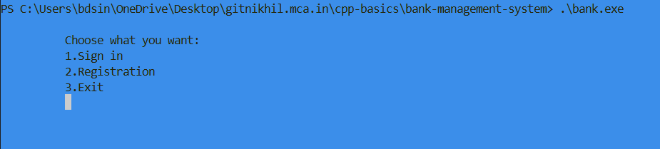
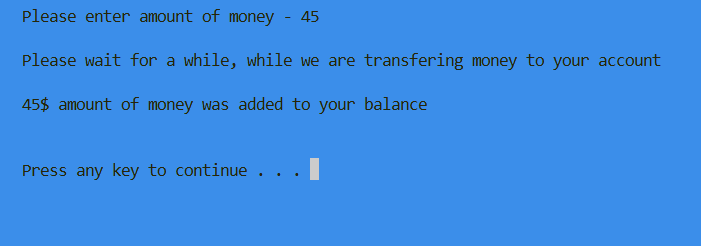

# 🏦 Bank Management System (C++)

A simple **Bank Management System** built using **C++** and **File Handling**.  
This project allows users to create accounts, sign in, deposit money, borrow money, return borrowed money, and check account balance through a console-based interface.

---

## 📌 Features

### 👤 Account Management
- User Registration
- User Login (Sign In)
- Password-based authentication
- Account data stored permanently using file handling

### 💰 Banking Operations
- Deposit Money
- Borrow Money from Bank
- Return Borrowed Money
- Check Account Balance

### 💾 Data Storage
- Uses `data.txt` file
- Stores:
  - Username
  - Password
  - Balance
  - Borrowed Amount

---

# ⚙️ Functions Used

| Function | Purpose |
|----------|---------|
| `MainMenu()` | Main login and registration menu |
| `Menu()` | Banking operations menu |
| `Deposit()` | Add money to account |
| `Borrow()` | Borrow money from bank |
| `Return()` | Return borrowed money |
| `CheckBalance()` | Display current balance |
| `outData()` | Load account data from file |
| `inputNewData()` | Save new account |
| `inputUpgradeData()` | Update account information |

---

# 🛠️ Technologies Used

- C++
- File Handling (`fstream`)
- Windows Console Functions
- `conio.h`
- `windows.h`
- Object-like struct design

---

# 📂 Project Structure

```text
cpp-basics/
│
└── bank-management-system/
    │
    ├── main.cpp
    ├── Header.h
    ├── data.txt
    ├── Project3.exe
    └── README.md
```

---
# 🚀 Installation & Setup

## Step 1: Clone Repository

Clone the repository:

```bash
git clone https://github.com/nikhil-mca-code/cpp-basics.git
```

Move into project folder:

```bash
cd cpp-basics/bank-management-system
```

---

## Step 2: Install C++ Compiler (Windows)

This project requires **g++ compiler**.

Recommended:

- MSYS2 + MinGW-w64

Verify installation:

```bash
g++ --version
```

---

## Step 3: Compile Project

Inside project folder run:

```bash
g++ main.cpp -o bank.exe
```

---

## Step 4: Run Program

Run:

```bash
.\bank.exe
```

# 🖥️ How to Use

## Main Menu

When program starts:

```text
1. Sign in
2. Registration
3. Exit
```

### Registration
- Create username
- Create password
- Account saved in `data.txt`

### Sign In
Login using:

- Username
- Password

After login:

```text
1. Actions with card
2. Check balance
0. Exit
```

Inside card actions:

```text
1. Deposit
2. Borrow money
3. Return money
0. Exit
```

---

# 💾 File Handling Format

Account data is stored in:

```text
data.txt
```

Format:

```text
name|password|balance|borrowed|
```

Example:

```text
nikhil|1234|5000|1000|
```

```md
## Main Menu


## Deposit Screen

```

---

# 🔮 Future Improvements

Possible upgrades:

- Better UI
- Account number generation
- Money withdrawal feature
- Interest calculation
- Admin panel
- Transaction history
- Database integration (MySQL)

---

# ⚠️ Limitations

Current version:

- Windows only (`windows.h`)
- Uses plain text file storage
- Passwords are not encrypted
- Limited validation

---

# 👨‍💻 Author

**Nikhil Singh**

GitHub:  
https://github.com/nikhil-mca-code

---

## ⭐ Support

If you like this project:

⭐ Star the repository  
🍴 Fork the repository  
💻 Improve and contribute